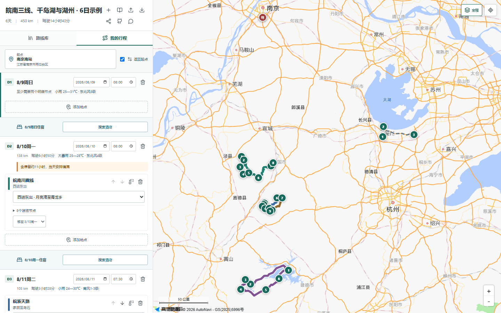

# 自驾路线规划器

把景观公路、普通地点和住宿按日期排在同一张地图上。项目匿名使用，不提供账号、酒店价格或自动生成攻略。

- 在线使用：[trip.yhdmt.site](https://trip.yhdmt.site)
- 源码仓库：[mituan-ai/china-roadtrip-planner](https://github.com/mituan-ai/china-roadtrip-planner)



## 能做什么

- 搜索全国范围内的起点、终点、普通地点和酒店。
- 按天组合路线、调整顺序、停留时间和住宿节点。
- 住宿同时作为前一天终点和次日起点，不生成虚假的过夜落点。
- 在高德底图上显示真实驾驶折线，并从手机网页唤起高德导航。
- 在天气预报覆盖范围内显示逐日天气。
- 本地自动保存，支持JSON和默认不含住宿的分享链接。

路线库目前只有5条经过核验的皖南、浙西路线：皖南川藏线、皖浙天路、浙西天路、皖浙1号公路和环千岛湖公路。普通地点规划不受该范围限制。

## 本地运行

需要 Node.js 22 和三个高德开放平台配置：Web端JS API Key、安全密钥、Web服务Key。每个部署者应申请并限制自己的Key，不要复用在线演示站的配置。

```powershell
Copy-Item .env.example .env
npm install
npm run dev
```

前端开发地址为 `http://127.0.0.1:5173`，API为 `http://127.0.0.1:3000`。

```powershell
npm run typecheck
npm test
npm run build
npm run test:e2e
```

## Docker

```powershell
Copy-Item .env.example .env
docker compose up -d --build
```

默认只在本机 `127.0.0.1:3000` 暴露服务。生产环境可使用 `compose.production.yaml` 加入已有Caddy网络：

```bash
docker compose -f compose.yaml -f compose.production.yaml pull
docker compose -f compose.yaml -f compose.production.yaml up -d --no-build
```

设置 `TRUST_PROXY=true`、`CADDY_NETWORK` 和自己的域名。`deploy.Caddyfile` 是可修改的Caddy模板。

## 数据与隐私

- 地图、POI和路线坐标统一使用GCJ-02。
- 行程保存在浏览器 `localStorage`；服务端不建立用户方案数据库。
- URL Hash不会随HTTP请求发送到服务器，分享时默认移除住宿。
- 地点关键词和路线坐标会经本站服务端发送给高德地图，以完成搜索、路线和天气请求。
- Web Service Key只存在服务器环境变量；Web端JS Key及其安全密钥按高德Web API要求发送到浏览器。

路线数据要求和贡献方法见 [CONTRIBUTING.md](CONTRIBUTING.md)，字段格式见 [docs/route-data-format.md](docs/route-data-format.md)，资料说明见 [DATA_SOURCES.md](DATA_SOURCES.md)。

## 许可证

[MIT](LICENSE) © 2026 mituan-ai contributors
