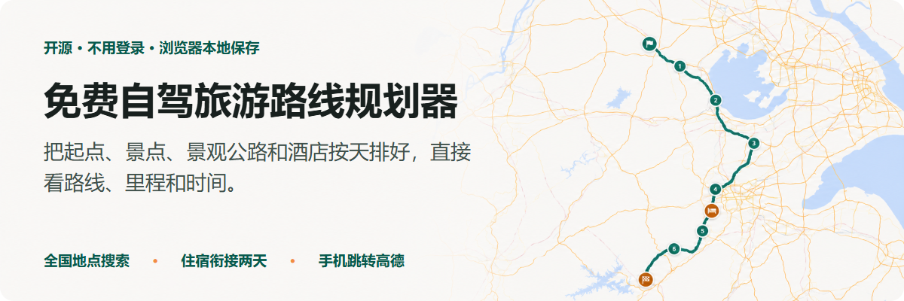
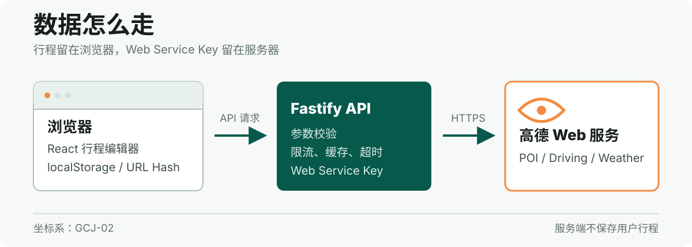

<p align="center">
  
</p>

<p align="center">
  <a href="https://trip.yhdmt.site"></a>
  <a href="https://github.com/mituan-ai/china-roadtrip-planner/actions/workflows/ci.yml"></a>
  <a href="https://github.com/mituan-ai/china-roadtrip-planner/releases/tag/v1.0.0"></a>
  <a href="./LICENSE"></a>
</p>

免费的自驾旅游路线规划器，不用登录。选起终点，把景点、景观公路和酒店按天排好，地图会画出路线，并算出每天的里程和驾驶时间。

路线绕不绕、一天开多久、酒店会不会让前后两天折返，都能直接看。

使用方法：选起终点和日期 → 加路线或地点 → 看地图调顺序。

<p align="center">
  <a href="https://trip.yhdmt.site"><strong>打开网站</strong></a>
  &nbsp;·&nbsp;
  <a href="https://github.com/mituan-ai/china-roadtrip-planner/issues">提问题</a>
  &nbsp;·&nbsp;
  <a href="./docs/route-data-format.md">添加路线</a>
</p>

<p align="center">
  
</p>

## 怎么用

1. 选起点、终点和日期。
2. 把路线模板或普通地点放到某一天。
3. 看地图和当天驾驶时间，再调顺序。
4. 需要过夜时搜索酒店。酒店会同时成为前一天终点和第二天起点。

手机点开地点后，可以跳到高德导航。行程保存在当前浏览器，也可导出 JSON。

## 现在有哪些路线

路线库现在只有5条皖南、浙西路线：

| 路线 | 可选方向或版本 |
| --- | --- |
| 皖南川藏线 | 西进东出、东进西出 |
| 皖浙天路 | 家朋至荆州及反向，岛石可选 |
| 浙西天路 | 59公里精华线、139公里环线 |
| 皖浙1号公路 | 屯溪至千岛湖及反向 |
| 环千岛湖公路 | 顺时针、逆时针 |

起终点和普通地点可以在全国范围搜索。路线模板仍需继续补充。

## 本地运行

需要 [Node.js 22+](https://nodejs.org/) 和三项高德开放平台配置：Web 端 JS API Key、安全密钥、Web 服务 Key。请申请自己的 Key 并限制可用域名。

```powershell
Copy-Item .env.example .env
npm install
npm run dev
```

- 前端：`http://127.0.0.1:5173`
- API：`http://127.0.0.1:3000`

```powershell
npm run typecheck
npm test
npm run build
npm run test:e2e
```

## 技术结构

<p align="center">
  
</p>

<p align="center">
  
  
  
  
  
  
  
  
</p>

- 前端使用 React、TypeScript、Vite 和 Zustand。
- Fastify 代理高德 Web 服务请求，Web Service Key 不进浏览器。
- Zod 校验行程、路线和 API 输入。
- Vitest 和 Playwright 覆盖域模型、API、桌面端和手机端流程。

## Docker

```powershell
Copy-Item .env.example .env
docker compose up -d --build
```

默认只在 `127.0.0.1:3000` 暴露服务。生产环境可以加入现有 Caddy 网络：

```bash
docker compose -f compose.yaml -f compose.production.yaml pull
docker compose -f compose.yaml -f compose.production.yaml up -d --no-build
```

生产环境设置 `TRUST_PROXY=true`、`CADDY_NETWORK` 和自己的域名。`deploy.Caddyfile` 是可直接修改的模板。

<details>
<summary><strong>数据与隐私</strong></summary>

- 地图、POI 和路线坐标统一使用 GCJ-02。
- 行程保存在浏览器 `localStorage`；服务端没有用户行程数据库。
- 分享数据放在 URL Hash，默认不包含住宿。
- 地点关键词和路线坐标会经服务端发送给高德，用于搜索、路线和天气请求。
- Web Service Key 只存在服务器环境变量中。Web 端 JS Key 和安全密钥会按高德 Web API 要求发送到浏览器。

</details>

## 目前不做什么

- 不做账号、云端方案库或社区。
- 不提供酒店价格、预订或付费功能。
- 天气只显示高德当前能查到的日期。
- 路线会受施工、管制和天气影响，出发前仍要看实时导航和当地通知。

## 添加路线

路线不是一串景点名。每条模板需要标明方向、可选节点、隐藏导航锚点、资料来源和核验日期。

- 贡献流程：[CONTRIBUTING.md](CONTRIBUTING.md)
- 路线数据格式：[docs/route-data-format.md](docs/route-data-format.md)
- 资料与核验要求：[DATA_SOURCES.md](DATA_SOURCES.md)
- 安全问题：[SECURITY.md](SECURITY.md)

## 许可证

[MIT](LICENSE) © 2026 mituan-ai contributors
